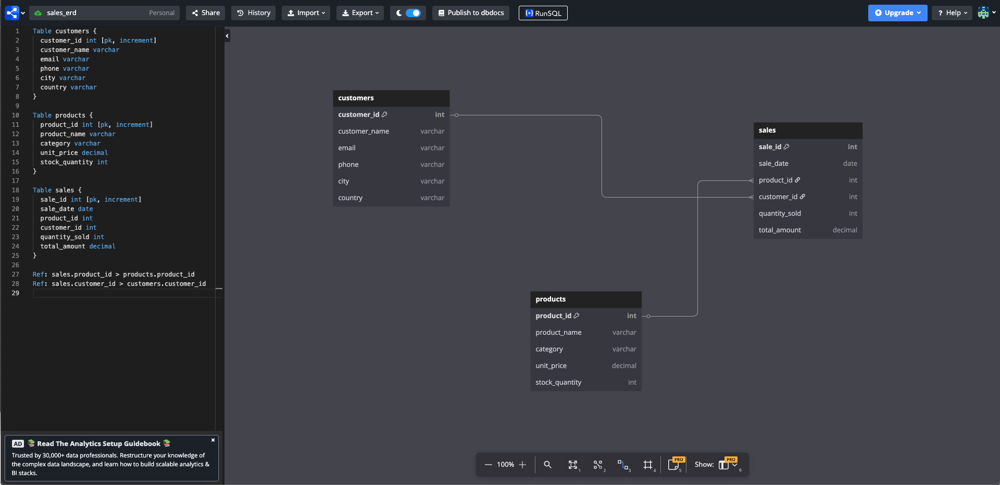

# SalesAnalyticsDB

## Introduction

This is a hands-on project I created to simulate backend reporting using MySQL. It’s designed for learning and showcasing SQL skills.

A MySQL-based backend sales database designed to simulate real-world business reporting.  
It includes entity relationships, schemas, and analytical queries for training and portfolio projects.

---

## Folder Structure

- `schema/` → Contains SQL files to create tables  
- `screenshots/` → ERD and table creation proof images  
- `data/` → Contains mock SQL insert files for customers, products, and sales tables  
- `queries/` → Analytical SQL queries  
- `views/` → SQL views & stored procedures  

---

## Tables Created

- `customers` — stores customer info like name, email, phone, , and date  
- `products` — stores product catalog data like name, category, price, and stock quantity  
- `sales` — stores sales transactions including quantity sold, total amount, and links to customer/product via foreign keys  

---

##  Mock Data Inserted

Mock data was generated using [Mockaroo](https://mockaroo.com/) for realism and inserted into the following tables:

- `customers` → Includes customer_name, email, phone, and date  
- `products` → Includes product_name, category, price, and stock quantity  
- `sales` → Includes foreign keys (customer_id, product_id), quantity_sold, total_amount, and sale_date  

All mock data insert files are saved in the `data/` folder.  
Visual confirmations (from MySQL Workbench) are saved in the `screenshots/` folder.

---

## ER Diagram



---

## Purpose

This project helps demonstrate skills in:

- MySQL schema design  
- Normalization and ER modeling  
- Writing complex SQL queries  
- Version control and GitHub usage  
- Project organization and documentation  

---

## Setup

You can execute the schema file using MySQL Workbench:

```sql
source schema/sales_schema.sql;
