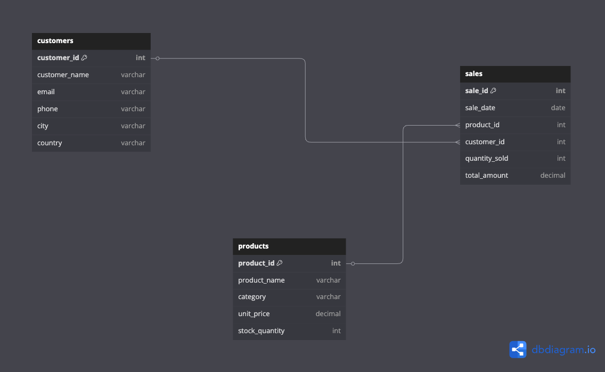

A MySQL based backend sales database designed to simulate real world business reporting.  
It includes entity relationships, schemas, and analytical queries for training and portfolio projects.

---

# Folder Structure

schema/ → Contains SQL files to create tables
screenshots/ → ERD and table creation proof images
data/ →  Sample customer, product, sales data
queries/ →  Analytical SQL queries
views/ →  SQL views or stored procedures


---

# Tables Created

- `customers` — stores customer info like name, email, signup date  
- `products` — product catalog 
- `sales` — transactions between customers and products 

---

# ER Diagram

> 

---

# Purpose

This project helps demonstrate skills in:
- MySQL schema design  
- Normalization and ER modeling  
- Writing complex SQL queries  
- Version control and GitHub usage  
- Project organization and documentation

---

#  Setup

You can execute the schema file using MySQL Workbench or CLI:

```sql
source schema/sales_schema.sql;

